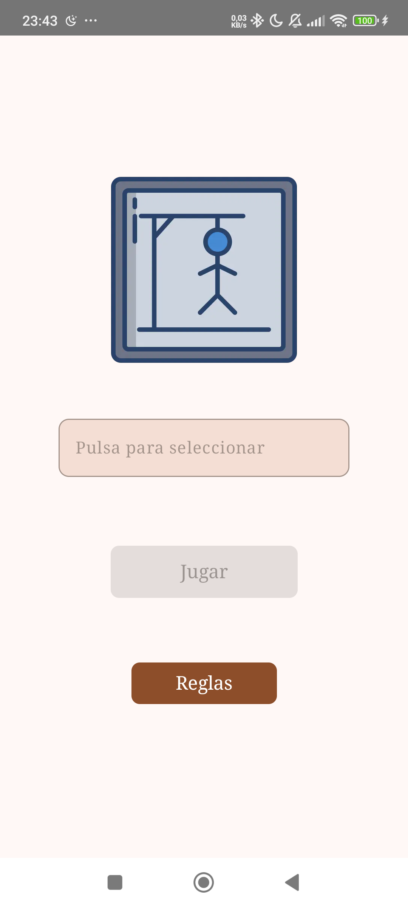

# HANGMAN APP
## Carlos Ayuso & David Correa
### Ésta es una app para Android escrita en Kotlin basada en el popular juego El Ahorcado.
### Empieza seleccionando una dificultad, entre fácil, medio y difícil. Pulsa una letra y verás si existe en la palabra o no, tienes hasta 5 intentos antes de que las milicias populares ajusticien al tirano opresor en la horca
### En tus manos está el poder para defender el antiguo regimen de las manos de vagos y maleantes

